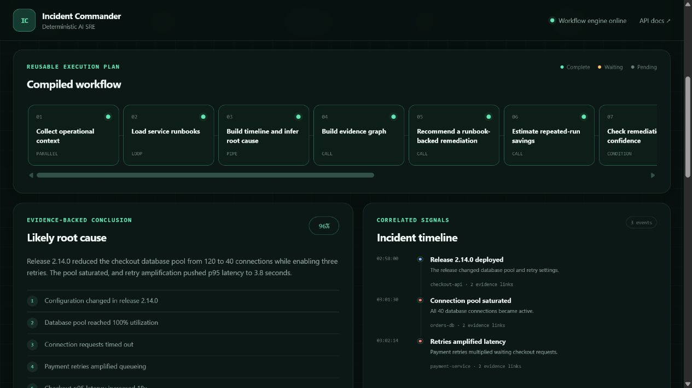
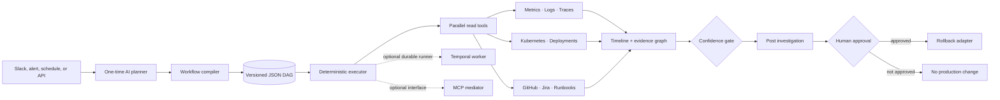

# Incident Commander

**Deterministic, evidence-backed SRE incident investigation with compiled MCP workflows.**

[](https://www.python.org/)
[](https://fastapi.tiangolo.com/)
[](https://modelcontextprotocol.io/)
[](https://github.com/DhruviTurakhia/incident-commander-ai/actions/workflows/ci.yml)
[](LICENSE)

Incident Commander is a portfolio-scale backend system for on-call engineers. It gathers
deployment history, metrics, logs, traces, Kubernetes state, commits, tickets, and runbooks;
turns those signals into an evidence-linked root-cause timeline; and pauses before production
remediation until a human approves the action.

The main design choice is simple: **use an LLM to design a workflow once, validate the plan,
and execute future incidents deterministically.** An LLM is not kept inside every tool step.



## What the demo shows

1. Select one of five production fault scenarios.
2. Eight operational tools run concurrently.
3. The workflow correlates a timeline and a service-dependency evidence graph.
4. Every root-cause claim links back to a metric, log, trace, deployment, or commit.
5. A high-confidence remediation stops at a human approval gate.
6. Approval resumes the same persisted run and records the destructive action.

The included fault lab covers:

| Scenario | Correlated root cause |
| --- | --- |
| Bad deployment | Pool-size reduction plus retries caused database saturation |
| Slow database query | A filter shipped without its required composite index |
| Memory leak | An unbounded personalization cache caused OOM restart loops |
| Expired credential | A suspended rotation job allowed a provider secret to expire |
| Queue backlog | A breaking event schema change trapped messages in retries |

## Architecture



### Workflow primitives

The JSON workflow supports seven validated primitives:

- `call` — invoke one registered tool;
- `parallel` — gather independent operational signals concurrently;
- `loop` — apply a tool to a list of services or resources;
- `pipe` — feed one deterministic stage into the next;
- `collect` — assemble named outputs into a report;
- `condition` — evaluate a restricted runtime predicate;
- `approval` — persist and pause before a protected action.

The compiler rejects unknown tools, duplicate nodes, missing dependencies, cycles, invalid node
shapes, and destructive nodes without an approval ancestor.

## Quick start

```bash
python -m venv .venv

# Windows
.\.venv\Scripts\activate

# macOS/Linux
source .venv/bin/activate

pip install -e ".[dev]"
incident-commander
```

Open [http://localhost:8000](http://localhost:8000). The interactive API documentation is at
[http://localhost:8000/docs](http://localhost:8000/docs).

Docker is also supported:

```bash
docker compose up --build
```

The local dashboard and all five scenarios work without external accounts or API keys.

## API walkthrough

Start an investigation:

```bash
curl -X POST http://localhost:8000/api/incidents/demo \
  -H "Content-Type: application/json" \
  -d '{"scenario_id":"bad-deployment"}'
```

The run returns `awaiting_approval`. Resume it with an audited approval:

```bash
curl -X POST http://localhost:8000/api/incidents/RUN_ID/approve \
  -H "Content-Type: application/json" \
  -d '{"approved_by":"Dhruvi Turakhia"}'
```

Other useful endpoints:

| Endpoint | Purpose |
| --- | --- |
| `GET /api/scenarios` | List the five fault scenarios |
| `GET /api/tools` | Inspect the discoverable tool catalog and risk levels |
| `GET /api/workflow` | Read the compiled, versioned workflow |
| `GET /api/incidents` | List persisted investigations |
| `GET /api/incidents/{run_id}` | Retrieve one evidence-backed report |

## Optional integrations

Install only the integrations you want:

```bash
pip install -e ".[mcp]"
pip install -e ".[slack]"
pip install -e ".[temporal]"
# or all integrations:
pip install -e ".[integrations]"
```

### MCP mediator

```bash
python -m incident_commander.integrations.mcp_server
```

It exposes four MCP tools: tool discovery, compiled-workflow inspection, incident investigation,
and approval/resumption. Streamable HTTP is used for the transport.

### Slack

Set `SLACK_BOT_TOKEN` and `SLACK_APP_TOKEN`, enable Socket Mode, and run:

```bash
python -m incident_commander.integrations.slack_bot
```

The `/investigate bad-deployment` command posts a Block Kit incident report with an approval
button. The production action still runs through the same persisted workflow service.

### Temporal

Start a local Temporal server and install the optional dependency, then run the worker:

```bash
python -c "import asyncio; from incident_commander.integrations.temporal_worker import run_worker; asyncio.run(run_worker())"
```

The durable workflow waits for an approval signal and can survive worker restarts while paused.

## Real implementation vs local simulation

This repository is deliberately clear about its scope:

| Implemented and tested | Simulated behind an adapter |
| --- | --- |
| JSON DAG validation and cycle detection | Prometheus metric responses |
| Async parallel, loop, pipe, condition, and collect execution | Loki log responses |
| Retry state and per-node execution audit | OpenTelemetry trace responses |
| SQLite persistence and resume after approval | Kubernetes cluster state and rollback result |
| Evidence ledger, timeline, and graph rendering | GitHub, Jira, and runbook data |
| FastAPI, dashboard, MCP, Slack, and Temporal entry points | Real production credentials and tenancy |

The simulated adapters make the system safe and reproducible for interviews. Each one can be
replaced with a real MCP server or API client without changing the workflow schema or executor.
The repository does **not** claim a production deployment.

## Safety model

- Tool definitions carry `read`, `write`, or `destructive` risk.
- Destructive nodes must declare `requires_approval` and have an approval ancestor.
- Runtime template evaluation supports path lookup only; it does not use `eval`.
- The UI displays a command preview but never accepts arbitrary shell input.
- Approver identity and time are stored with the run.
- `.env` and the local SQLite database are excluded from Git.
- Real deployments should add tenant-scoped credentials, RBAC, signed webhooks, and an external
  secrets manager. See [the threat model](docs/threat-model.md).

## Tests

```bash
ruff check .
pytest --cov=incident_commander --cov-report=term-missing
```

The 14-test suite compiles the DAG, rejects unsafe plans, executes all five fault scenarios,
verifies the approval pause, resumes the destructive action, reloads the completed run from
SQLite, and exercises the API end to end.

## Repository map

```text
src/incident_commander/
├── engine/              # compiler, executor, safe template resolver
├── integrations/        # MCP, Slack Socket Mode, Temporal
├── planner/             # provider-neutral one-shot LLM planner
├── static/              # zero-build investigation dashboard
├── tools/               # registry, risk metadata, demo adapters
├── api.py               # FastAPI endpoints
├── models.py            # workflow and incident contracts
├── repository.py        # SQLite run persistence
└── service.py           # application orchestration
workflows/               # versioned JSON workflow
fixtures/scenarios/      # five reproducible incidents
tests/                   # compiler, executor, persistence, and API tests
docs/                    # architecture, threat model, and demo script
```

## Design references

- [Separating Intelligence from Execution: A Workflow Engine for the Model Context Protocol](https://arxiv.org/abs/2605.00827)
  describes the MCP mediator and reusable workflow blueprint pattern that inspired the compiler.
- The [official MCP Python SDK](https://py.sdk.modelcontextprotocol.io/) documents MCP clients,
  servers, tool discovery, and Streamable HTTP.
- The [Temporal Python SDK](https://github.com/temporalio/sdk-python) provides durable,
  fault-tolerant workflow execution; its OpenAI Agents integration demonstrates the same
  durability principle for agent workloads.
- [Slack Bolt Socket Mode](https://docs.slack.dev/tools/bolt-python/concepts/socket-mode/) allows
  the bot to receive events without exposing a public request URL.
- [OpenTelemetry Python](https://opentelemetry.io/docs/languages/python/) is the reference model
  for trace and metric instrumentation used by the adapters.

## Roadmap

- Replace demo adapters with tenant-scoped MCP connections.
- Store workflow versions and rollback history in PostgreSQL.
- Map every node to a Temporal activity for distributed execution.
- Add scheduled and event-triggered runs.
- Add a visual DAG editor and workflow marketplace.
- Export investigation spans through OTLP.
- Add policy-as-code for approval thresholds and production environments.

## Author

Built by **Dhruvi Turakhia** as a backend and distributed-systems portfolio project.
