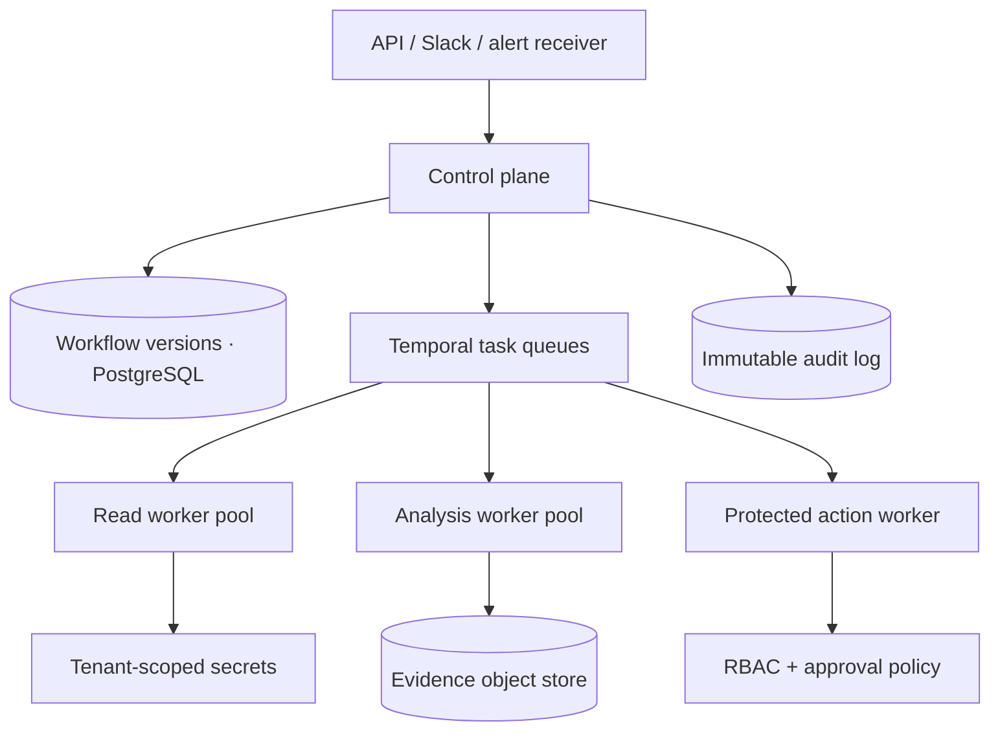

# Architecture decisions

## 1. Intelligence is separated from execution

An optional planner receives a natural-language request plus the discovered tool catalog. Its only
output is JSON. The workflow compiler validates that JSON before it can be versioned or executed.
The runtime never asks an LLM which tool to call next.

This keeps repeated runs cheaper, easier to test, and easier to audit. It also narrows the
security boundary: generated text cannot directly invoke tools.

## 2. The workflow is a DAG

Each node has a stable identifier and explicit dependencies. The compiler performs:

- Pydantic schema validation;
- node and dependency validation;
- cycle detection;
- tool-catalog validation;
- approval-ancestor validation for protected writes.

The executor runs all ready nodes concurrently. The `parallel` primitive adds concurrency inside
a node when the result should be grouped as one logical collection step.

## 3. Runs are resumable

Every node stores status, attempt count, timestamps, duration, and error. The full run is persisted
as versioned JSON in SQLite. When execution reaches `approval`, the node becomes
`awaiting_approval` and the executor returns. Approval updates the same run and resumes from the
paused node; successful nodes are not executed again.

SQLite keeps the portfolio demo easy to run. A production version would normalize run metadata in
PostgreSQL and move large evidence payloads to object storage.

## 4. Evidence is first-class data

Every adapter returns structured evidence with:

- source;
- signal type;
- service;
- observation time;
- value;
- anomaly score;
- optional source URL and tags.

The root cause contains evidence identifiers rather than untraceable prose. The timeline and graph
use the same identifiers.

## 5. Tools declare risk

Tool definitions are registered with a risk level:

- `read`;
- `write`;
- `destructive`.

The rollback adapter is destructive. Its node declares `requires_approval`, and the compiler
requires an approval ancestor. The executor passes an approval capability only after that ancestor
has an audit record.

## 6. Integration boundaries stay replaceable

The demo adapters implement the same registry contract that real MCP or HTTP adapters would use.
The workflow does not know whether `metrics.query` reads a fixture, Prometheus, or an MCP server.

This keeps the core engine independent of Slack, Temporal, a model provider, or any observability
vendor.

## Production evolution

The production boundary adds distributed workers, tenant-scoped encryption keys, policy-as-code,
signed inbound events, immutable audit retention, and per-tenant rate and cost limits.

